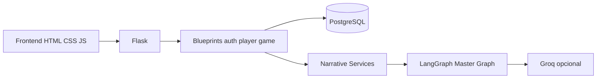
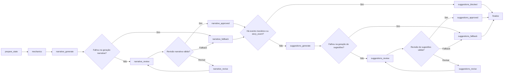

# O Reino Partido de Bjornsson

Aplicação web de RPG narrativo ambientada em Elandoria, com cadastro de jogadores, criação de personagem, persistência em PostgreSQL e um mestre conversacional opcional apoiado por Groq + LangGraph.

O projeto combina:

- backend em Flask
- frontend server-rendered em HTML, CSS e JavaScript puro
- banco PostgreSQL com SQLAlchemy + Alembic
- motor narrativo com cenas, combates, puzzle e memória persistida

## Sumário

- [Visão geral](#visão-geral)
- [O que o projeto entrega](#o-que-o-projeto-entrega)
- [Fluxo do jogador](#fluxo-do-jogador)
- [Arquitetura](#arquitetura)
- [Rotas principais](#rotas-principais)
- [Estrutura do repositório](#estrutura-do-repositório)
- [Execução local](#execução-local)
- [Variáveis de ambiente](#variáveis-de-ambiente)
- [Docker](#docker)
- [Testes](#testes)
- [Modo com e sem Groq](#modo-com-e-sem-groq)
- [Estado atual e limitações](#estado-atual-e-limitações)

## Visão geral

O jogo apresenta o universo de **O Reino Partido de Bjornsson** a partir do presente do reino de **Elandoria**. O jogador cria um personagem, escolhe raça, rola atributos, define uma classe e entra em uma jornada guiada pelo "Mestre de Elandoria".

Hoje o projeto já possui uma base funcional de produto: autenticação de usuário, onboarding completo do personagem, Capítulo I jogável, inventário/XP/ouro persistidos, chat com mestre narrativo, rolagens pendentes com consequência separada, sugestões de ações, memória resumida e testes para backend, fluxo narrativo e partes do frontend.

## O que o projeto entrega

- landing page pública, login e registro
- criação de ficha com nome, idade, personalidade, objetivo e medo
- seleção de raça, incluindo raças especiais com d20
- rolagem sequencial de 7 atributos
- seleção de classe com validação por requisitos
- área do jogador e ficha completa
- Capítulo I em Elandoria com atos, encontros e puzzle
- drops, XP, ouro e janela de loot pós-combate
- reset de campanha mantendo a ficha
- migrações automáticas ao iniciar a aplicação
- Docker Compose para app + banco

Catálogo atual do jogo: 10 raças, 12 classes, 7 atributos, 4 táticas de encontro e 11 monstros catalogados.

## Fluxo do jogador

1. O usuário cria a conta em `/registro` e faz login em `/login`.
2. A aplicação redireciona para `/jogador/ficha`.
3. O jogador escolhe uma raça em `/jogador/raca`.
4. `Anjo` e `Demônio` dependem de uma rolagem especial:
   - `Anjo`: `15+`
   - `Demônio`: `16+`
5. O jogador rola `FOR`, `DEX`, `CON`, `INT`, `SAB`, `CAR` e `PER`.
6. O sistema libera apenas as classes cujos requisitos foram atendidos.
7. Depois da classe escolhida, o personagem entra em `/jogo`.
8. A campanha alterna entre escolhas de cena, encontros, conversa livre com o mestre e atualização de inventário, XP, ouro e estado narrativo.

Resumo do Capítulo I:

- **Ato 1**: `chapter_entry`, `encounter_goblin`, `encounter_robalo`
- **Ato 2**: `act_two_crossroads`, `encounter_duende`, `encounter_cobra`, `encounter_raposa`
- **Ato 3**: `act_three_threshold`, `encounter_aranha`, `encounter_lupus`, `encounter_passaro`
- **Ato 4**: `freya_legacy`
- **Ato 5**: `encounter_lobisomem`, `chapter_complete`

Ao concluir o capítulo, o personagem recebe o `Cristal Incompreendido` e um legado ligado a Rowan ou Freya, dependendo do perfil da classe.

## Arquitetura

### Stack

| Camada | Tecnologia |
| --- | --- |
| Backend web | Flask 3 |
| ORM | SQLAlchemy 2 |
| Migrações | Alembic |
| Banco | PostgreSQL |
| Senhas | bcrypt |
| LLM gateway | Groq |
| Orquestração narrativa | LangGraph |
| Frontend | HTML + CSS + JavaScript puro |
| Servidor em container | gunicorn |

### Visão rápida



### Componentes principais

- `backend/app.py`: carrega `.env`, registra blueprints e roda migrações antes de subir o servidor
- `backend/web_blueprints/`: separa rotas de autenticação, jogador e jogo
- `backend/narrative/`: concentra estado, memória, rolagem, sugestões e ciclo do mestre
- `backend/master_graph.py`: organiza geração, revisão, fallback e finalização do pipeline narrativo
- `frontend/game_play.html` + `frontend/script.js`: renderizam a interface principal e sincronizam a cena sem hard reload

### Ordem do grafo narrativo

O `master_graph.py` segue uma ordem fixa de estágios, com ramificações controladas para revisão, fallback e bloqueio de sugestões:



Na prática, o grafo sempre começa em `prepare_state`, passa por leitura mecânica em `mechanics`, tenta produzir a narração, revisa a saída, pode revisar uma vez antes de cair em fallback, só gera sugestões se não houver bloqueio de evento e termina consolidando narração, evento, próxima cena e ações sugeridas.

## Rotas principais

### Páginas

| Rota | Função |
| --- | --- |
| `/` | landing page |
| `/login` | login |
| `/registro` | cadastro |
| `/jogador` | área do jogador |
| `/jogador/ficha` | criação da ficha |
| `/jogador/raca` | seleção de raça |
| `/jogador/status` | rolagem de atributos |
| `/jogador/classe` | seleção de classe |
| `/jogador/ficha-completa` | ficha consolidada |
| `/jogo` | tela principal do gameplay |

### Ações

| Rota | Método | Função |
| --- | --- | --- |
| `/logout` | `POST` | encerra sessão |
| `/jogador/status/rolar-modal` | `POST` | rola os atributos no modal |
| `/jogador/raca/rolar` | `POST` | resolve raça especial |
| `/jogo/mestre` | `POST` | envia mensagem ao mestre |
| `/jogo/rolar` | `POST` | inicia a rolagem pendente |
| `/jogo/rolar/consequencia` | `POST` | devolve a consequência narrativa |
| `/jogo/resetar-campanha` | `POST` | reinicia o capítulo mantendo a ficha |

## Estrutura do repositório

```text
.
|-- backend/
|   |-- app.py
|   |-- app_factory.py
|   |-- database.py
|   |-- models.py
|   |-- game_content.py
|   |-- master_graph.py
|   |-- master_pipeline/
|   |-- narrative/
|   |-- web_blueprints/
|   `-- web_support/
|-- frontend/
|   |-- index.html
|   |-- login.html
|   |-- register.html
|   |-- character_create.html
|   |-- race_select.html
|   |-- status_page.html
|   |-- class_select.html
|   |-- player_home.html
|   |-- character_sheet.html
|   |-- game_play.html
|   |-- script.js
|   |-- game_ui_helpers.js
|   `-- styles.css
|-- alembic/
|-- tests/
|-- docker-compose.yml
|-- Dockerfile
`-- requirements.txt
```

## Execução local

### Pré-requisitos

- Python 3.12 recomendado
- PostgreSQL 16 recomendado
- Node 18+ opcional para o teste JS
- Docker opcional

### 1. Criar ambiente virtual

```powershell
py -3.12 -m venv .venv
.\.venv\Scripts\Activate.ps1
py -m pip install --upgrade pip
py -m pip install -r requirements.txt
```

### 2. Configurar o banco

Você pode usar um PostgreSQL local ou subir apenas o banco pelo Compose:

```powershell
docker compose up -d db
```

### 3. Criar o `.env`

```env
SECRET_KEY=troque-por-uma-chave-segura
POSTGRES_HOST=127.0.0.1
POSTGRES_PORT=5432
POSTGRES_DB=bjornsson
POSTGRES_USER=postgres
POSTGRES_PASSWORD=postgres

# Opcional: habilita o mestre conversacional
GROQ_API_KEY=sua-chave-aqui
```

Se preferir, `DATABASE_URL` pode substituir os `POSTGRES_*`.

### 4. Rodar a aplicação

```powershell
py backend/run.py
```

Ao iniciar localmente, a aplicação:

1. espera o banco ficar disponível
2. executa `alembic upgrade head`
3. sobe o servidor Flask

Padrão local:

- app: `http://127.0.0.1:8000`
- banco: `127.0.0.1:5432`

### 5. Rodar apenas migrações

```powershell
py backend/migrate.py
```

## Variáveis de ambiente

| Variável | Default | Uso |
| --- | --- | --- |
| `SECRET_KEY` | `dev-secret-key` | chave de sessão do Flask |
| `DATABASE_URL` | vazio | URL completa do banco |
| `POSTGRES_HOST` | `127.0.0.1` | host do banco |
| `POSTGRES_PORT` | `5432` | porta do banco |
| `POSTGRES_DB` | `bjornsson` | nome do banco |
| `POSTGRES_USER` | `postgres` | usuário do banco |
| `POSTGRES_PASSWORD` | `postgres` | senha do banco |
| `DB_CONNECT_RETRIES` | `20` | tentativas de conexão |
| `DB_CONNECT_DELAY` | `1.5` | intervalo entre tentativas |
| `FLASK_HOST` | `127.0.0.1` | host do app |
| `FLASK_PORT` | `8000` | porta do app |
| `FLASK_DEBUG` | `true` | modo debug |
| `GROQ_API_KEY` | vazio | habilita o mestre conversacional |
| `GROQ_MODEL_NARRATIVE` | `qwen/qwen3-32b` | modelo narrativo |
| `GROQ_MODEL_FAST` | `llama-3.1-8b-instant` | modelo rápido |
| `GROQ_TIMEOUT_SECONDS` | `25.0` | timeout global da Groq |
| `GROQ_MAX_TOKENS` | `700` | limite global de tokens |
| `TOTP_ISSUER_NAME` | vazio | legado reservado para futura expansão de 2FA |

## Docker

Para subir app + PostgreSQL:

```powershell
docker compose up -d --build
```

Para derrubar:

```powershell
docker compose down
```

Para derrubar e remover o volume do banco:

```powershell
docker compose down -v
```

Serviços: `bjornsson-db` com PostgreSQL 16 Alpine e volume persistente, e `bjornsson-app` com Python 3.12 Slim, migrações e `gunicorn`.

## Testes

Testes Python:

```powershell
.\.venv\Scripts\python.exe -m unittest discover -s tests -p "test_*.py"
```

Teste JavaScript do helper de UI:

```powershell
node --test tests/test_frontend_roll_modal.js
```

A suíte cobre fluxo de cenas e transições, pipeline do mestre, runtime do gateway Groq, rotas do backend, serviço de rolagem, sincronização do frontend e lifecycle do modal de rolagem.

## Modo com e sem Groq

| Recurso | Sem `GROQ_API_KEY` | Com `GROQ_API_KEY` |
| --- | --- | --- |
| Onboarding e campanha estruturada | sim | sim |
| Encontros, drops, XP e ouro | sim | sim |
| Tela principal do jogo | sim | sim |
| Chat em `/jogo/mestre` | não | sim |
| Intro dinâmica do mestre | fallback local | sim |
| Sugestões narrativas | fallback local | sim |
| Resumo de memória com LLM | não | sim |

Na prática, sem Groq o projeto continua jogável como experiência guiada; com Groq, a experiência fica mais conversacional e flexível.

## Estado atual e limitações

- o projeto está concentrado no Capítulo I, embora a base permita expansão
- parte do estado narrativo fica serializada em texto na tabela `characters`
- o frontend é propositalmente simples, sem framework de componentes
- o README antigo citava `2FA com TOTP e QR code`, mas isso não está integrado ao fluxo atual
- existem campos de 2FA no modelo e no ambiente, mas não há validação TOTP ativa no login

## Resumo técnico rápido

- RPG web com Flask no backend e HTML/CSS/JS puro no frontend
- PostgreSQL, SQLAlchemy e Alembic para persistência
- onboarding completo de personagem
- campanha inicial jogável em Elandoria
- estado, inventário, XP, ouro e mensagens persistidos
- mestre conversacional opcional com Groq + LangGraph
