# O Reino Partido de Bjornsson

Aplicação web de RPG narrativo ambientada em Elandoria. O jogador cria uma conta, monta uma ficha, escolhe raça e classe, rola atributos e joga uma campanha inicial guiada por cenas, encontros, rolagens, recompensas e estado persistido.

O projeto também possui um **Mestre de Elandoria** opcional com **Groq + LangGraph**. A IA gera narrações, interpreta ações livres e sugere próximos passos, enquanto o backend continua responsável pelas regras, estado do personagem, inventário, XP, ouro, cenas, eventos mecânicos e persistência.

Em resumo, este repositório não é apenas um chat com IA. Ele é um RPG web com fluxo estruturado, banco de dados, campanha jogável e uma camada de IA controlada por grafo, validações e fallbacks.

## Sumário

- [Visão Geral](#visão-geral)
- [O Que O Projeto Entrega](#o-que-o-projeto-entrega)
- [Tour Visual Da Interface](#tour-visual-da-interface)
- [Fluxo Do Jogador](#fluxo-do-jogador)
- [Gameplay E Campanha](#gameplay-e-campanha)
- [Como O Mestre Funciona](#como-o-mestre-funciona)
- [Como O Grafo Narrativo Funciona](#como-o-grafo-narrativo-funciona)
- [Como A IA É Usada](#como-a-ia-é-usada)
- [Arquitetura](#arquitetura)
- [Persistência E Estado](#persistência-e-estado)
- [Rotas Principais](#rotas-principais)
- [Estrutura Do Repositório](#estrutura-do-repositório)
- [Execução Local](#execução-local)
- [Variáveis De Ambiente](#variáveis-de-ambiente)
- [Docker](#docker)
- [Testes](#testes)
- [Modo Com E Sem Groq](#modo-com-e-sem-groq)
- [Estado Atual E Limitações](#estado-atual-e-limitações)

## Visão Geral

**O Reino Partido de Bjornsson** apresenta uma jornada de fantasia medieval no reino de **Elandoria**. O jogador passa por um onboarding completo de personagem e depois entra no Capítulo I, onde pode explorar cenas, enfrentar criaturas, resolver momentos de risco, receber recompensas e conversar com o mestre narrativo.

O projeto já possui uma base funcional de produto:

- autenticação de usuários;
- criação completa de personagem;
- seleção de raça e classe;
- rolagem sequencial de atributos;
- campanha inicial jogável;
- estado narrativo persistido;
- inventário, XP e ouro persistidos;
- encontros e rolagens pendentes;
- consequência narrativa separada da rolagem;
- chat com mestre narrativo quando Groq está configurado;
- sugestões de ações contextuais;
- memória resumida da campanha;
- testes para backend, pipeline narrativo, fluxo de cenas, rolagens e partes do frontend.

O objetivo técnico do projeto é combinar uma campanha estruturada com liberdade narrativa. A campanha define cenas, atos, monstros, progresso e recompensas; a IA atua dentro desses limites para tornar a experiência mais conversacional.

## O Que O Projeto Entrega

### Produto

- landing page pública;
- login e registro;
- área do jogador;
- criação de ficha com nome, idade, personalidade, objetivo e medo;
- seleção de raça;
- rolagem especial para raças raras;
- rolagem sequencial de 7 atributos;
- seleção de classe baseada em requisitos;
- ficha consolidada;
- tela principal de gameplay;
- campanha inicial em Elandoria;
- chat narrativo com o mestre quando a IA está habilitada;
- sugestões de ações para acelerar o fluxo do jogador;
- reset de campanha mantendo a ficha.

### RPG

- 10 raças catalogadas;
- 12 classes catalogadas;
- 7 atributos;
- 4 táticas de encontro;
- 11 monstros catalogados;
- Capítulo I dividido em atos;
- encontros com criaturas;
- puzzle e progresso narrativo;
- drops, XP, ouro e janela de loot pós-combate;
- item final `Cristal Incompreendido`;
- legado final ligado a Rowan ou Freya, dependendo do perfil da classe.

### Técnico

- backend em Flask;
- frontend server-rendered com HTML, CSS e JavaScript puro;
- banco PostgreSQL;
- ORM com SQLAlchemy;
- migrações com Alembic;
- senha com bcrypt;
- Docker Compose para app + banco;
- LangGraph para orquestração do mestre;
- Groq como provider opcional de LLM;
- fallbacks locais para manter a experiência jogável sem IA;
- testes automatizados em Python e JavaScript.

## Tour Visual Da Interface

Esta seção mostra o fluxo do produto do ponto de vista do jogador: apresentação do reino, acesso, criação de personagem, onboarding de RPG e gameplay com o Mestre de Elandoria.

### Mapa Resumido Do Fluxo Visual

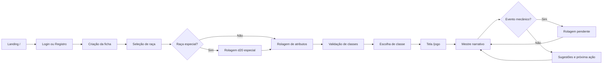

Esse fluxo visual acompanha a mesma cadeia do backend: autenticação cria a sessão do usuário, ficha e escolhas atualizam o registro do personagem, atributos liberam classes, e a tela de jogo passa a puxar cena, estado narrativo, mensagens, inventário, recompensas e sugestões do mestre.

### Apresentação Do Reino

A tela inicial apresenta o tom da campanha, o mapa de fundo e a entrada para o primeiro capítulo.

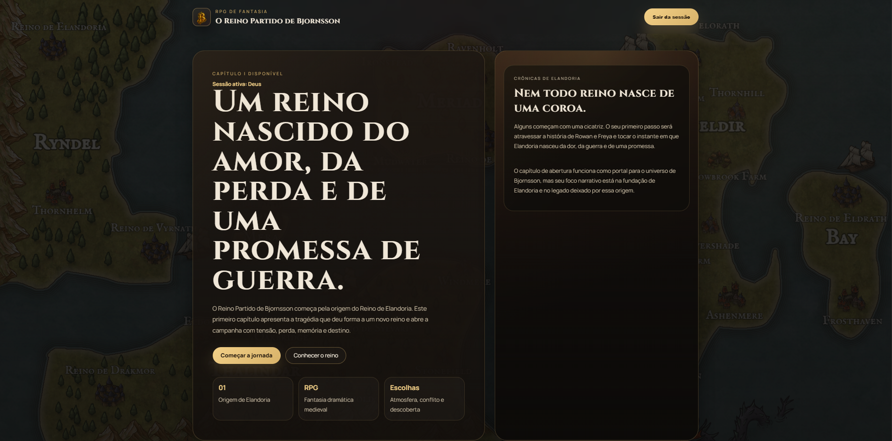

**Fluxo:** a landing page é a porta pública do projeto. Ela não depende de personagem criado; serve para apresentar o universo e direcionar o jogador para login, registro ou abertura narrativa.

A página de introdução do capítulo explica o contexto da origem de Elandoria antes do jogador entrar na campanha.

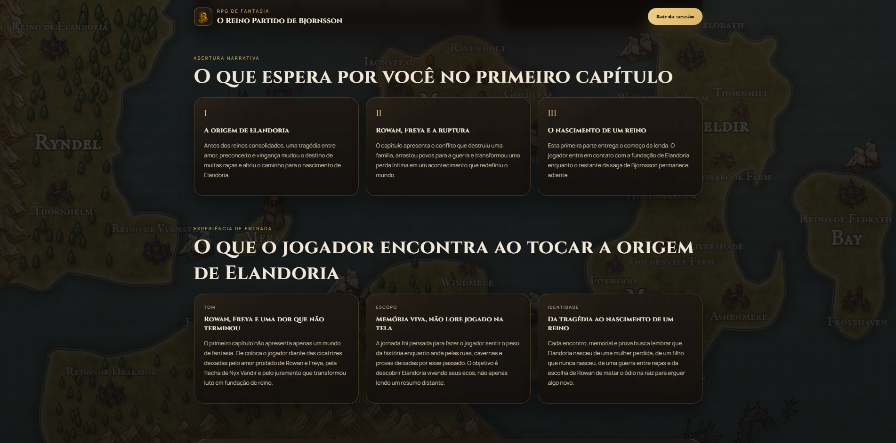

**Fluxo:** essa tela contextualiza o Capítulo I antes do gameplay. Ela puxa texto estático do frontend e prepara o jogador para entrar no fluxo autenticado, onde o backend passa a controlar ficha, progresso e sessão.

### Acesso Do Jogador

O jogador pode criar uma conta ou entrar com uma conta existente antes de iniciar a jornada.

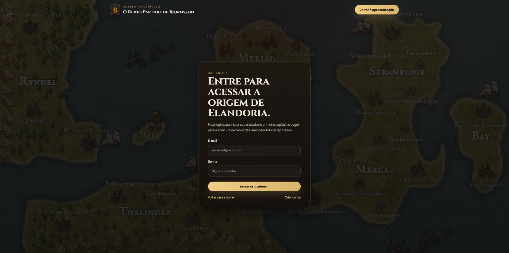

**Fluxo:** o login valida e-mail e senha, cria a sessão Flask e permite que as rotas protegidas identifiquem o usuário atual. Depois disso, o backend decide se o jogador ainda precisa criar ficha ou se já pode seguir para a área do jogador.

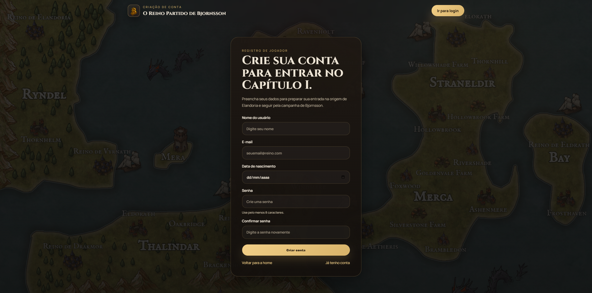

**Fluxo:** o registro cria o usuário no PostgreSQL com senha protegida por bcrypt. Esse usuário passa a ser a raiz dos personagens e mensagens persistidas durante a campanha.

### Criação Do Personagem

A ficha começa com dados narrativos: nome, idade, personalidade, objetivo e medo. Esses campos ajudam o mestre a contextualizar a narração durante a campanha.

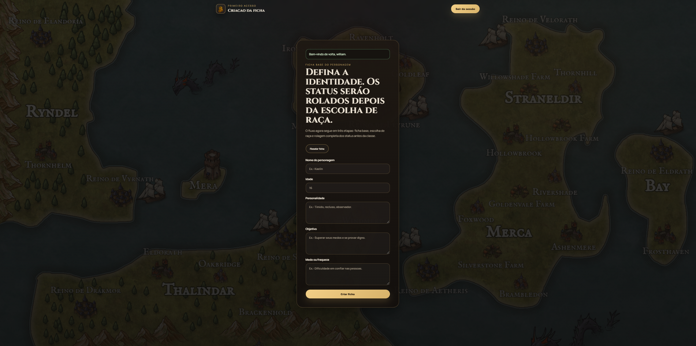

**Fluxo:** essa etapa cria ou atualiza o personagem associado ao usuário. Nome, personalidade, objetivo e medo entram depois no `character_state`, que é enviado ao mestre narrativo para personalizar a cena.

Depois da ficha base, o jogador escolhe a raça. Algumas raças são comuns e podem ser escolhidas diretamente.

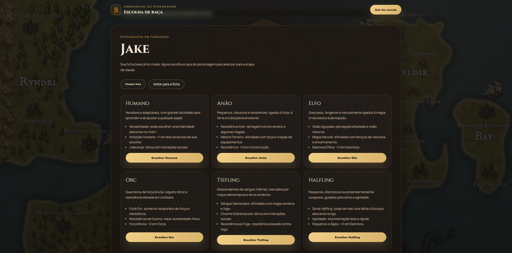

**Fluxo:** a tela de raça lê o catálogo de raças do jogo e grava a escolha no personagem. Raças comuns avançam direto para a rolagem de atributos.

Raças especiais, como Anjo e Demônio, exigem uma rolagem de d20 antes de serem liberadas.

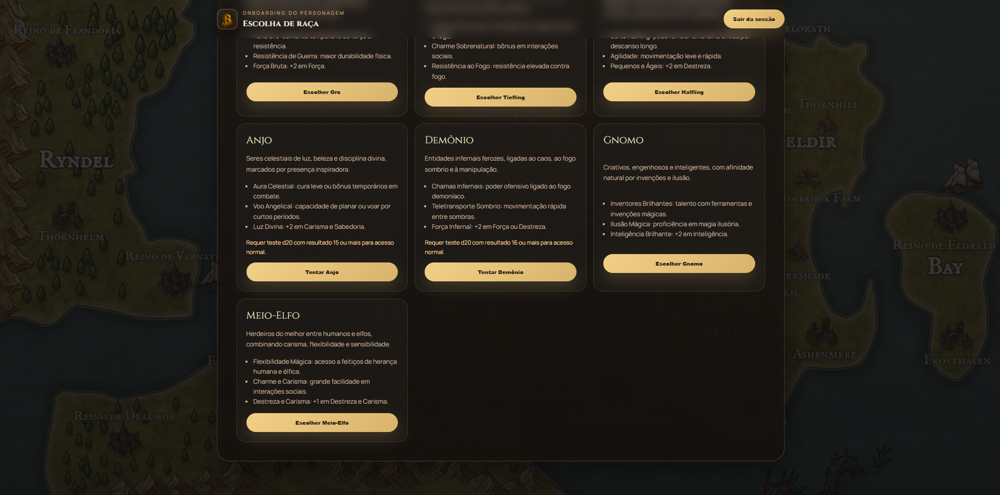

**Fluxo:** ao tentar uma raça especial, o frontend chama a rota de rolagem de raça. O backend calcula o d20, compara com a dificuldade da raça e só persiste a escolha se o resultado for suficiente.

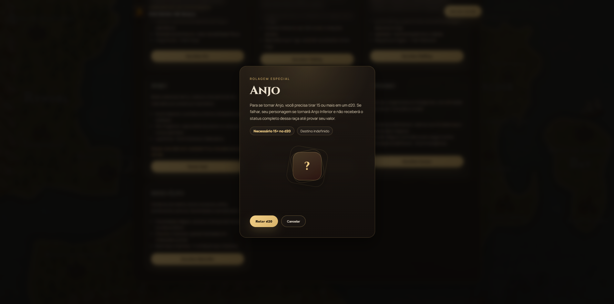

**Fluxo:** Anjo exige resultado `15+` no d20. Se falhar, o personagem não recebe essa raça e precisa escolher outra opção.

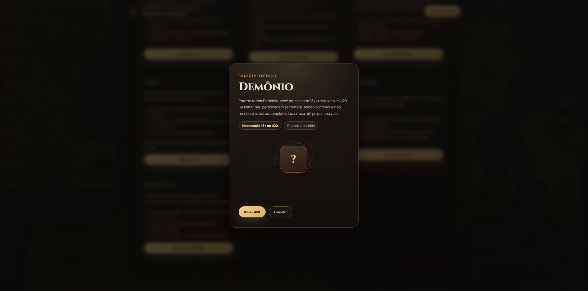

**Fluxo:** Demônio exige resultado `16+` no d20. A lógica é a mesma: o dado decide se a raça pode ser persistida no personagem.

### Atributos E Classe

Após escolher a raça, o jogador rola os atributos do personagem. O sistema revela os valores em sequência e usa esses resultados para validar classes disponíveis.

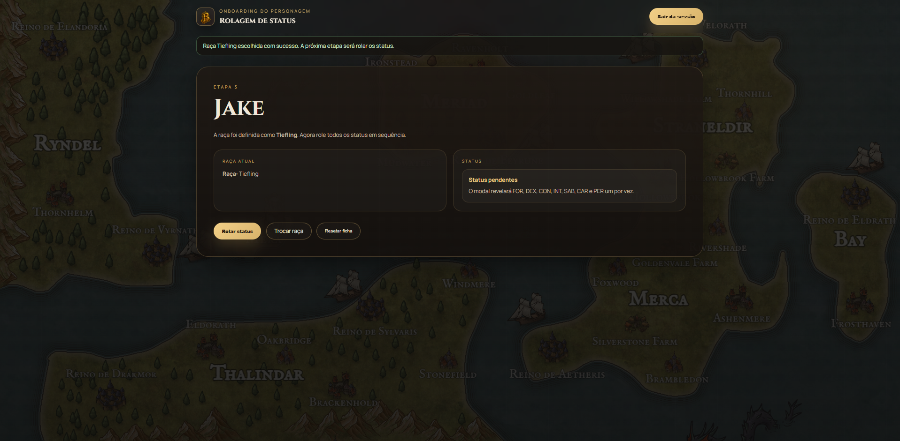

**Fluxo:** a página de status só é liberada depois da raça. Ela consulta quais atributos ainda estão pendentes e prepara o modal para rolar `FOR`, `DEX`, `CON`, `INT`, `SAB`, `CAR` e `PER`.

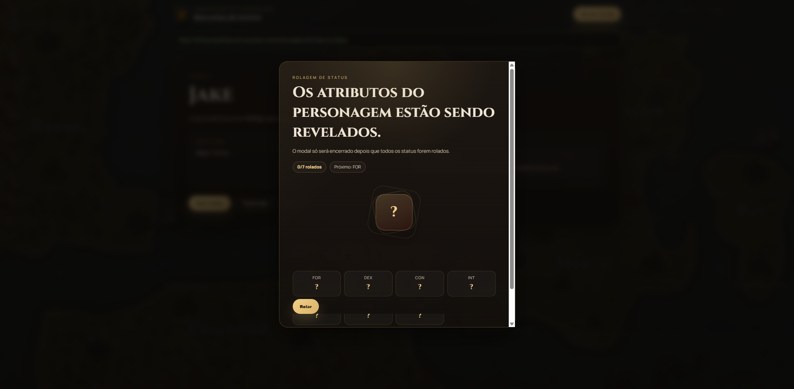

**Fluxo:** cada rolagem atualiza um atributo no personagem. Quando os 7 atributos existem, o backend libera a próxima etapa: seleção de classe.

A seleção de classe mostra requisitos atendidos e bloqueios. Isso deixa claro por que uma classe está ou não disponível.

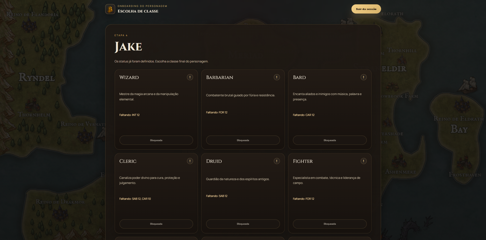

**Fluxo:** a tela de classe compara os atributos persistidos com os requisitos do catálogo. Classes sem requisito atendido aparecem bloqueadas e informam o atributo faltante.

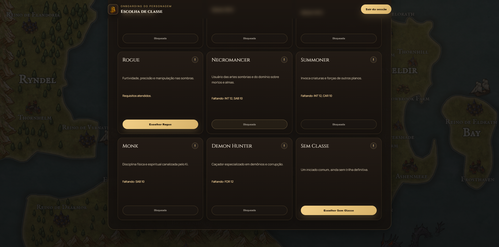

**Fluxo:** quando uma classe tem requisitos atendidos, o botão de escolha fica disponível. Ao confirmar, o backend grava a classe no personagem e libera a entrada em `/jogo`.

### Gameplay

A tela principal reúne a narração do mestre, o momento atual, dados do personagem, progresso, atributos, inventário e sugestões de ações.

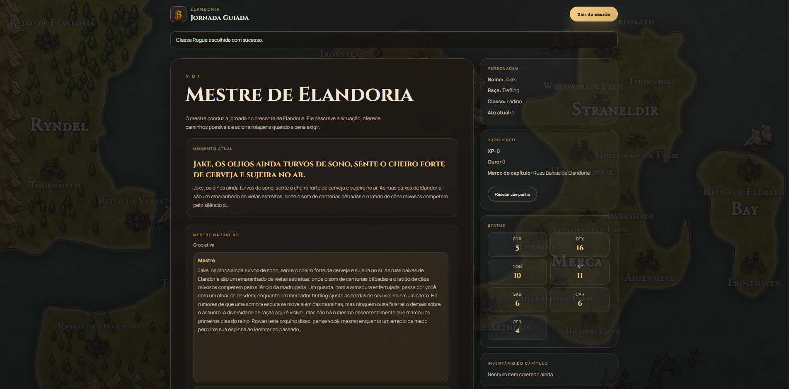

**Fluxo:** `/jogo` carrega o personagem, inicializa a campanha se necessário, puxa a cena atual, mensagens recentes, resumo de memória, evento pendente, recompensa recente, inventário e ações sugeridas. Esse conjunto monta o snapshot exibido no frontend.

As sugestões do mestre aparecem como opções contextuais, mas o jogador também pode escrever uma ação livre.

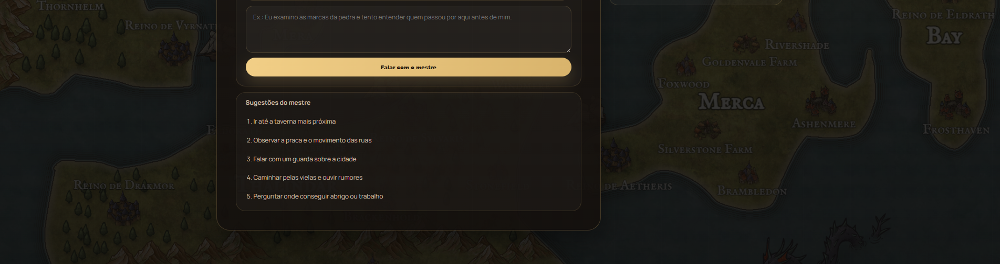

**Fluxo:** as sugestões vêm do estado persistido ou são montadas por fallback local. Com Groq configurado, o grafo pode gerar sugestões contextuais; sem Groq, o backend usa ações padrão da cena. Quando há rolagem pendente, as sugestões são bloqueadas para forçar a resolução do dado.

## Fluxo Do Jogador

1. O usuário cria uma conta em `/registro`.
2. O usuário faz login em `/login`.
3. A aplicação redireciona para `/jogador/ficha`.
4. O jogador informa nome, idade, personalidade, objetivo e medo.
5. O jogador escolhe uma raça em `/jogador/raca`.
6. Se escolher uma raça especial, precisa passar em uma rolagem:
   - `Anjo`: resultado `15+`;
   - `Demônio`: resultado `16+`.
7. O jogador rola os 7 atributos em `/jogador/status`:
   - `FOR`;
   - `DEX`;
   - `CON`;
   - `INT`;
   - `SAB`;
   - `CAR`;
   - `PER`.
8. O sistema libera apenas as classes cujos requisitos foram atendidos.
9. O jogador escolhe a classe em `/jogador/classe`.
10. A ficha completa fica disponível em `/jogador/ficha-completa`.
11. O jogador entra em `/jogo`.
12. A campanha alterna entre cenas, escolhas, encontros, conversa livre, rolagens e recompensas.

## Gameplay E Campanha

O Capítulo I é uma campanha estruturada. Isso significa que a experiência não depende apenas da IA: existem cenas, atos, transições, monstros e recompensas definidos no backend.

### Estrutura Do Capítulo I

- **Ato 1**: `chapter_entry`, `encounter_goblin`, `encounter_robalo`
- **Ato 2**: `act_two_crossroads`, `encounter_duende`, `encounter_cobra`, `encounter_raposa`
- **Ato 3**: `act_three_threshold`, `encounter_aranha`, `encounter_lupus`, `encounter_passaro`
- **Ato 4**: `freya_legacy`
- **Ato 5**: `encounter_lobisomem`, `chapter_complete`

### Tipos De Interação

Durante a campanha, o jogador pode:

- seguir opções de cena;
- enviar mensagens livres ao mestre;
- investigar o ambiente;
- iniciar ou reagir a encontros;
- resolver rolagens pendentes;
- receber consequências narrativas;
- coletar recompensas;
- avançar para novas cenas.

### Rolagens Pendentes

Quando uma ação exige risco mecânico, o sistema não resolve tudo em uma única resposta. O fluxo é separado:

1. O jogador envia uma ação livre ou escolhe uma ação sugerida.
2. O mestre identifica que existe um evento mecânico.
3. O backend registra uma rolagem pendente.
4. O frontend mostra a interface de rolagem.
5. O jogador rola.
6. O backend calcula o resultado.
7. O mestre gera ou seleciona a consequência narrativa.
8. O estado da campanha é atualizado.

Esse desenho evita que a IA narre um sucesso ou fracasso antes do dado existir.

## Como O Mestre Funciona

O **Mestre de Elandoria** é a camada que transforma o estado do jogo em uma resposta jogável. Ele recebe o personagem, a cena atual, mensagens recentes, memória resumida, inventário, recompensas recentes, eventos pendentes e transições permitidas.

O GIF abaixo demonstra esse ciclo na interface: o jogador vê a narração atual, pode seguir uma sugestão do mestre ou escrever uma ação própria, envia a mensagem e recebe uma resposta nova produzida pelo pipeline narrativo.


O mestre trabalha em três modos principais:

| Modo | Quando É Usado | Resultado Esperado |
| --- | --- | --- |
| `intro` | primeira entrada em uma cena ou início da campanha | apresentação da cena e sugestões iniciais |
| `turn` | mensagem livre do jogador no chat | narração, possível evento mecânico, possível próxima cena e sugestões |
| `resolution` | consequência de uma rolagem já feita | narração do resultado e atualização do momento |

O mestre não recebe permissão irrestrita para alterar o jogo. O backend prepara um **estado autoritativo**, que informa o que é permitido naquele momento: tipos de ação aceitos, cena atual, próximas cenas válidas, alvo atual, evento pendente, recompensa recente e restrições de contexto.

## Como O Grafo Narrativo Funciona

O mestre narrativo não é uma chamada direta para a IA. Ele é um pipeline controlado por **LangGraph** em `backend/master_graph.py`.

Cada nó do grafo tem uma responsabilidade pequena e previsível:

| Nó | Responsabilidade |
| --- | --- |
| `prepare_state` | normaliza entrada, cena, inventário, mensagens recentes, estado autoritativo e ações fallback |
| `mechanics` | decide se a ação do jogador exige rolagem, teste ou encontro |
| `narrative_generate` | gera a narração principal do mestre |
| `narrative_review` | valida se a narração está limpa, coerente e segura para exibir |
| `narrative_revise` | pede uma correção para a IA quando a revisão falha |
| `narrative_fallback` | cria uma narração local quando a IA falha ou não passa na revisão |
| `narrative_approved` | aprova a narração final |
| `suggestions_generate` | gera sugestões de próximas ações |
| `suggestions_review` | valida quantidade, idioma, contexto e coerência das sugestões |
| `suggestions_revise` | pede uma correção para sugestões inválidas |
| `suggestions_fallback` | usa sugestões locais quando a IA falha ou gera sugestões ruins |
| `suggestions_blocked` | bloqueia sugestões quando há rolagem ou evento obrigatório pendente |
| `finalize` | consolida narração, evento, story event, próxima cena e sugestões |

### Fluxo Do Grafo

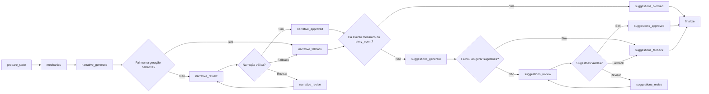

**Leitura do diagrama, do início ao fim:**

1. O fluxo começa em `prepare_state`. Esse nó recebe o estado bruto montado pelos serviços narrativos e normaliza tudo que o grafo precisa: modo da execução, cena atual, cenas permitidas, monstros disponíveis, personagem, inventário, mensagens recentes, evento pendente, recompensa recente, autoridade narrativa e ações fallback.
2. Depois o grafo chama `mechanics`. Esse estágio olha principalmente para a mensagem do jogador e decide se existe um evento mecânico imediato, como teste de atributo ou encontro. Ele não narra a cena; só detecta se há algo que precisa de dado.
3. Em seguida vem `narrative_generate`. Esse nó usa a cena, o lore, o personagem, a mensagem do jogador e o possível evento mecânico para gerar a narração do mestre. Se a geração falhar, o grafo desvia direto para `narrative_fallback`.
4. Se a narração foi gerada, ela passa por `narrative_review`. A revisão verifica se o texto está vazio, se vazou JSON ou termo técnico, se parece recusa do modelo, se quebrou continuidade, se trouxe anacronismo ou se narrou algo fisicamente incoerente.
5. Quando a revisão reprova, o grafo tenta `narrative_revise` uma vez. Essa revisão pede para a IA corrigir apenas o problema encontrado. Se ainda não ficar válido, o fluxo cai em `narrative_fallback`, que monta uma resposta local segura.
6. Quando a narração é aprovada, `narrative_approved` congela a narração final e guarda também `next_scene` ou `story_event`, se existirem.
7. Depois da narração, o grafo decide se pode gerar sugestões. Se houver evento mecânico ou `story_event`, ele vai para `suggestions_blocked`, porque o jogador precisa resolver o evento antes de receber novas opções.
8. Se não houver bloqueio, o grafo chama `suggestions_generate`. Esse nó gera de 2 a 5 ações possíveis para o momento atual.
9. As sugestões passam por `suggestions_review`. A revisão checa quantidade, idioma, coerência com a narração, aderência ao estado autoritativo e se as ações não ficaram genéricas demais.
10. Se as sugestões forem ruins, o grafo tenta `suggestions_revise` uma vez. Se ainda falhar, usa `suggestions_fallback`, que monta ações locais baseadas na cena e no estado permitido.
11. O fluxo termina em `finalize`. Esse nó consolida o que será devolvido ao resto do backend: narração final, evento mecânico, próxima cena, story event, sugestões aprovadas e diagnósticos do pipeline.

Na prática, o grafo funciona como uma esteira de controle de qualidade. A IA pode gerar texto e sugestões, mas cada saída passa por parser, revisão, limite de tentativa e fallback antes de chegar ao jogador.

### Regras Importantes Do Grafo

- O grafo sempre começa normalizando o estado.
- A detecção mecânica acontece antes da narração.
- A narração pode ser revisada uma vez antes de cair em fallback.
- Sugestões só são geradas quando não existe evento obrigatório pendente.
- Sugestões também podem ser revisadas uma vez antes de fallback.
- O frontend recebe apenas o resultado consolidado em `finalize`.
- A execução registra `execution_trace` e `pipeline_diagnostics`, úteis para testes e depuração.

## Como A IA É Usada

A IA é opcional e depende de `GROQ_API_KEY`. Quando habilitada, ela é usada em pontos específicos, sempre mediada pelo backend.

### Agentes Do Pipeline

| Agente | Arquivo | Papel |
| --- | --- | --- |
| `MechanicsAgent` | `backend/master_pipeline/mechanics_agent.py` | identifica se a intenção do jogador exige evento mecânico |
| `NarrativeAgent` | `backend/master_pipeline/narrative_agent.py` | gera ou revisa a narração principal |
| `SuggestionAgent` | `backend/master_pipeline/suggestion_agent.py` | gera ou revisa sugestões de próximas ações |

### O Que A IA Pode Fazer

- interpretar a intenção livre do jogador;
- sugerir um teste de atributo ou encontro quando fizer sentido;
- escrever a narração do mestre;
- adaptar a cena ao personagem e ao histórico recente;
- gerar falas e atmosfera medieval;
- sugerir próximas ações contextuais;
- revisar narrações e sugestões inválidas;
- resumir memória da campanha depois de várias mensagens.

### O Que A IA Não Deve Controlar Diretamente

- XP;
- ouro;
- dano;
- inventário;
- drops;
- recompensas;
- migrações de banco;
- autenticação;
- classe ou raça do personagem;
- regras de desbloqueio de classe;
- aplicação final de eventos de história;
- persistência do estado.

Essas responsabilidades ficam no backend. A IA devolve texto ou JSON estruturado; o sistema faz parse, valida, sanitiza e decide o que realmente entra no estado do jogo.

### Validações E Proteções

O pipeline revisa e limpa saídas da IA para evitar:

- JSON aparecendo para o jogador;
- termos técnicos como `next_scene` ou `story_event` vazando na narração;
- narração inteira entre aspas;
- recusa do modelo no lugar de continuação da cena;
- troca incoerente da entidade em foco;
- quebra de causalidade física;
- anacronismos como telefone, carro, motor, plástico ou arma moderna;
- sugestões genéricas demais;
- sugestões em inglês;
- sugestões que contradizem a narração;
- sugestões fora das ações permitidas pelo estado autoritativo.

### Memória Da Campanha

As mensagens do jogador e do mestre são persistidas no banco. Quando o histórico cresce, o serviço de memória pode chamar a IA para gerar um resumo curto com fatos duradouros:

- decisões importantes;
- estilo do jogador;
- interesses;
- desconfianças;
- alianças;
- itens narrativos;
- pistas;
- tom emocional da campanha.

Esse resumo entra nos próximos prompts para manter continuidade sem enviar todo o histórico ao modelo.

## Arquitetura

### Stack

| Camada | Tecnologia |
| --- | --- |
| Backend web | Flask 3 |
| ORM | SQLAlchemy 2 |
| Migrações | Alembic |
| Banco | PostgreSQL |
| Senhas | bcrypt |
| LLM gateway | Groq |
| Orquestração narrativa | LangGraph |
| Frontend | HTML + CSS + JavaScript puro |
| Servidor em container | gunicorn |

### Visão Rápida

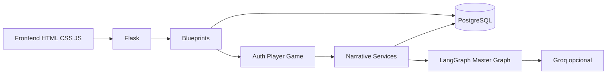

**Leitura do diagrama, do início ao fim:**

1. O jogador interage com páginas HTML, CSS e JavaScript no frontend. O frontend não decide regra de campanha sozinho; ele mostra formulários, botões, modais, mensagens e envia requisições para o backend.
2. O Flask recebe essas requisições e direciona cada uma para um blueprint. Os blueprints separam os domínios principais: autenticação, fluxo do jogador e gameplay.
3. As rotas de autenticação cuidam de login, registro e sessão. As rotas de jogador cuidam de ficha, raça, atributos e classe. As rotas de jogo cuidam da tela principal, conversa com o mestre, rolagens e reset de campanha.
4. Sempre que há dado durável, o backend usa SQLAlchemy para ler ou gravar no PostgreSQL. Isso inclui usuário, personagem, atributos, cena atual, inventário, mensagens, memória e estado narrativo.
5. Quando a rota envolve gameplay narrativo, o blueprint chama os serviços em `backend/narrative/`. Esses serviços montam o contexto da cena, carregam mensagens recentes, verificam evento pendente, buscam inventário, calculam recompensas e preparam o estado do mestre.
6. Para respostas do mestre, os serviços narrativos chamam o `LangGraph Master Graph`. O grafo organiza a execução em etapas: mecânica, narração, revisão, sugestões, fallback e finalização.
7. Se `GROQ_API_KEY` estiver configurada, os agentes do grafo podem chamar a Groq para interpretar ações, gerar narrações e sugerir próximos passos. Se a Groq não estiver configurada ou falhar, o backend usa fallbacks locais.
8. O resultado volta para os serviços narrativos, que persistem o que precisa ser salvo e devolvem um snapshot para o frontend renderizar.

Essa arquitetura mantém uma separação importante: o frontend mostra a experiência, o Flask organiza as rotas, o banco guarda a verdade persistida, os serviços narrativos aplicam regra de jogo, o LangGraph orquestra o mestre e a Groq entra apenas como motor opcional de linguagem.

### Fluxo De Uma Mensagem Do Jogador

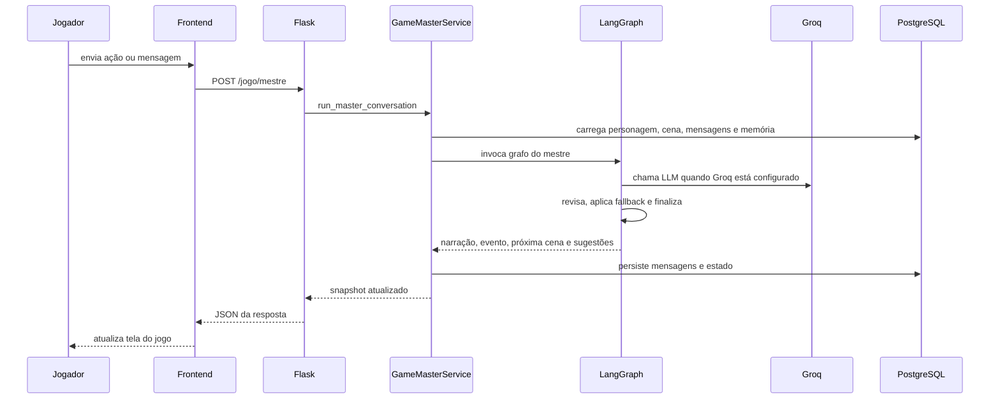

**Leitura do diagrama, do início ao fim:**

1. O jogador está em `/jogo` e envia uma mensagem livre ou clica em uma sugestão do mestre.
2. O JavaScript do frontend envia essa ação para `POST /jogo/mestre`.
3. O blueprint de jogo recebe a requisição, identifica o personagem da sessão e chama `run_master_conversation`.
4. O serviço do mestre garante que a campanha foi inicializada. Se o personagem ainda não tem cena, ele cria o estado inicial do Capítulo I.
5. O backend carrega a cena atual, flags narrativas, inventário, evento pendente, recompensa recente, mensagens recentes e último resumo de memória.
6. Com esses dados, `build_master_graph_state` monta o estado que será entregue ao grafo. Esse estado inclui `character_state`, `lore_packet`, `allowed_next_scenes`, `available_monsters`, `recent_messages`, `authoritative_state` e `fallback_actions`.
7. O `LangGraph Master Graph` executa o pipeline. Primeiro normaliza o estado, depois detecta evento mecânico, gera narração, revisa a resposta, decide se pode gerar sugestões e finaliza o resultado.
8. Se Groq estiver ativa, os agentes de mecânica, narrativa e sugestões podem chamar o modelo. Se a chamada falhar ou a resposta não passar nas validações, o grafo usa fallback local.
9. O serviço recebe o resultado final do grafo. Se houver `story_event`, ele aplica a transição de história. Se houver evento mecânico, ele registra uma rolagem pendente e não gera novas sugestões. Se houver `next_scene`, ele persiste a nova cena.
10. O backend salva as mensagens do jogador e do mestre, atualiza sugestões, autoridade narrativa, contexto e estado da campanha conforme necessário.
11. Se a memória acumulada já tiver volume suficiente, o serviço pode gerar um resumo com LLM para uso nos próximos turnos.
12. A rota devolve um JSON com mensagem do mestre, evento pendente, próxima cena, momento atual, sugestões e estado visual atualizado.
13. O frontend recebe esse JSON e atualiza a tela sem precisar recarregar a página inteira.

O ponto central desse fluxo é que a mensagem do jogador não vai direto para a IA e volta para a tela. Ela passa por estado persistido, autoridade narrativa, grafo, revisão, fallback e persistência antes de aparecer como resposta final.

### Componentes Principais

| Caminho | Responsabilidade |
| --- | --- |
| `backend/app.py` | cria a aplicação, carrega `.env`, registra blueprints e conecta dependências |
| `backend/run.py` | ponto de entrada local |
| `backend/app_factory.py` | factory do Flask |
| `backend/database.py` | engine, sessão e utilitários do banco |
| `backend/models.py` | modelos SQLAlchemy |
| `backend/game_content.py` | catálogo de raças, classes, atributos, monstros e conteúdo de jogo |
| `backend/master_graph.py` | grafo canônico do mestre com LangGraph |
| `backend/master_state.py` | normalização de estado e construção de autoridade/fallbacks |
| `backend/master_pipeline/` | agentes, prompts, parsers, revisores e runtime de LLM |
| `backend/narrative/` | serviços de campanha, memória, rolagem, cenas, eventos e estado |
| `backend/web_blueprints/` | rotas separadas por domínio: auth, player e game |
| `backend/web_support/` | helpers usados pelos blueprints |
| `backend/lore/` | pacotes de lore enviados ao mestre |
| `frontend/` | páginas HTML, CSS, JS e assets |
| `docs/screenshots/` | imagens e GIF usados no README |
| `alembic/` | configuração e versões de migração |
| `tests/` | testes Python e JavaScript |

## Persistência E Estado

O projeto persiste informações importantes para permitir continuidade de campanha.

### Principais Dados Persistidos

- usuário;
- hash de senha;
- ficha do personagem;
- raça e classe;
- atributos;
- cena atual;
- ato atual;
- flags narrativas;
- inventário narrativo;
- XP;
- ouro;
- evento pendente;
- recompensa recente;
- autoridade narrativa recente;
- sugestões de ações;
- mensagens do jogo;
- resumos de memória.

### Estado Autoritativo

O estado autoritativo é uma camada de segurança narrativa. Ele descreve a verdade atual do jogo e limita o que a IA pode sugerir.

Exemplos de informações controladas por essa camada:

- cena atual;
- próximas cenas permitidas;
- se existe rolagem pendente;
- se existe recompensa recente;
- alvo atual;
- nível de perigo;
- tipos de ação permitidos;
- fase da cena;
- contexto pós-combate;
- itens relevantes no inventário.

Na prática, a IA pode escrever uma narração mais rica, mas não deve sobrescrever a verdade do backend.

## Rotas Principais

### Páginas

| Rota | Função |
| --- | --- |
| `/` | landing page |
| `/login` | login |
| `/registro` | cadastro |
| `/jogador` | área do jogador |
| `/jogador/ficha` | criação da ficha |
| `/jogador/raca` | seleção de raça |
| `/jogador/status` | rolagem de atributos |
| `/jogador/classe` | seleção de classe |
| `/jogador/ficha-completa` | ficha consolidada |
| `/jogo` | tela principal do gameplay |

### Ações

| Rota | Método | Função |
| --- | --- | --- |
| `/logout` | `POST` | encerra sessão |
| `/jogador/status/rolar-modal` | `POST` | rola os atributos no modal |
| `/jogador/raca/rolar` | `POST` | resolve raça especial |
| `/jogo/mestre` | `POST` | envia mensagem ao mestre |
| `/jogo/rolar` | `POST` | inicia a rolagem pendente |
| `/jogo/rolar/consequencia` | `POST` | devolve a consequência narrativa |
| `/jogo/resetar-campanha` | `POST` | reinicia o capítulo mantendo a ficha |

## Estrutura Do Repositório

```text
.
|-- backend/
|   |-- app.py
|   |-- app_factory.py
|   |-- database.py
|   |-- models.py
|   |-- game_content.py
|   |-- master_graph.py
|   |-- master_state.py
|   |-- master_pipeline/
|   |   |-- mechanics_agent.py
|   |   |-- narrative_agent.py
|   |   |-- suggestion_agent.py
|   |   |-- prompts.py
|   |   |-- parsers.py
|   |   |-- reviewers.py
|   |   |-- runtime.py
|   |   `-- contracts.py
|   |-- narrative/
|   |   |-- game_master_service.py
|   |   |-- turn_service.py
|   |   |-- turn_pipeline.py
|   |   |-- scene_flow.py
|   |   |-- roll_service.py
|   |   |-- action_rolls.py
|   |   |-- story_events.py
|   |   |-- memory_service.py
|   |   |-- state_store.py
|   |   |-- authority.py
|   |   |-- llm_gateway.py
|   |   `-- web_handlers.py
|   |-- web_blueprints/
|   |-- web_support/
|   `-- lore/
|-- frontend/
|   |-- index.html
|   |-- login.html
|   |-- register.html
|   |-- character_create.html
|   |-- race_select.html
|   |-- status_page.html
|   |-- class_select.html
|   |-- player_home.html
|   |-- character_sheet.html
|   |-- game_play.html
|   |-- script.js
|   |-- game_ui_helpers.js
|   |-- styles.css
|   `-- assets/
|-- docs/
|   `-- screenshots/
|-- alembic/
|-- tests/
|-- docker-compose.yml
|-- Dockerfile
|-- requirements.txt
`-- README.md
```

## Execução Local

### Pré-Requisitos

- Python 3.12 recomendado;
- PostgreSQL 16 recomendado;
- Node 18+ opcional para o teste JavaScript;
- Docker opcional.

### 1. Criar Ambiente Virtual

```powershell
py -3.12 -m venv .venv
.\.venv\Scripts\Activate.ps1
py -m pip install --upgrade pip
py -m pip install -r requirements.txt
```

### 2. Configurar O Banco

Você pode usar um PostgreSQL local ou deixar a aplicação subir o banco pelo Compose na primeira execução. Para subir apenas o banco manualmente:

```powershell
docker compose up -d db
```

### 3. Criar O `.env`

```env
SECRET_KEY=troque-por-uma-chave-segura
POSTGRES_HOST=127.0.0.1
POSTGRES_PORT=5432
POSTGRES_DB=bjornsson
POSTGRES_USER=postgres
POSTGRES_PASSWORD=postgres

# Opcional: habilita o mestre conversacional
GROQ_API_KEY=sua-chave-aqui
```

Se preferir, `DATABASE_URL` pode substituir os campos `POSTGRES_*`.

### 4. Rodar A Aplicação

```powershell
py backend/run.py
```

Ao iniciar localmente, a aplicação:

1. verifica se o banco local do Compose existe e inicia o serviço `db` se necessário;
2. usa um PostgreSQL local já aberto em `127.0.0.1:5432` caso não exista container do projeto;
3. espera o banco ficar disponível;
4. executa `alembic upgrade head`;
5. sobe o servidor Flask.

Padrão local:

- app: `http://127.0.0.1:8000`;
- banco: `127.0.0.1:5432`.

### 5. Rodar Apenas Migrações

```powershell
py backend/migrate.py
```

## Variáveis De Ambiente

### Aplicação E Banco

| Variável | Default | Uso |
| --- | --- | --- |
| `SECRET_KEY` | `dev-secret-key` | chave de sessão do Flask |
| `DATABASE_URL` | vazio | URL completa do banco; se definida, substitui `POSTGRES_*` |
| `POSTGRES_HOST` | `127.0.0.1` | host do banco |
| `POSTGRES_PORT` | `5432` | porta do banco |
| `POSTGRES_DB` | `bjornsson` | nome do banco |
| `POSTGRES_USER` | `postgres` | usuário do banco |
| `POSTGRES_PASSWORD` | `postgres` | senha do banco |
| `DB_CONNECT_RETRIES` | `20` | tentativas de conexão com o banco |
| `DB_CONNECT_DELAY` | `1.5` | intervalo entre tentativas |
| `FLASK_HOST` | `127.0.0.1` | host do app |
| `FLASK_PORT` | `8000` | porta do app |
| `FLASK_DEBUG` | `true` | modo debug |

### IA E Groq

| Variável | Default | Uso |
| --- | --- | --- |
| `GROQ_API_KEY` | vazio | habilita chamadas para Groq |
| `GROQ_MODEL_NARRATIVE` | `qwen/qwen3-32b` | modelo usado nos estágios narrativos |
| `GROQ_MODEL_FAST` | `llama-3.1-8b-instant` | modelo rápido usado quando o estágio pede `fast` |
| `GROQ_MODEL` | vazio | fallback legado para modelo narrativo |
| `GROQ_TIMEOUT_SECONDS` | `25.0` | timeout global |
| `GROQ_TIMEOUT_SECONDS_NARRATIVE` | vazio | timeout específico para narrativa |
| `GROQ_TIMEOUT_SECONDS_FAST` | vazio | timeout específico para estágios rápidos |
| `GROQ_MAX_TOKENS` | `700` | limite global de tokens |
| `GROQ_MAX_TOKENS_NARRATIVE` | vazio | limite específico para narrativa |
| `GROQ_MAX_TOKENS_FAST` | vazio | limite específico para estágios rápidos |

### Legado

| Variável | Default | Uso |
| --- | --- | --- |
| `TOTP_ISSUER_NAME` | vazio | reservado para futura expansão de 2FA |

## Docker

Para subir app + PostgreSQL:

```powershell
docker compose up -d --build
```

Para derrubar:

```powershell
docker compose down
```

Para derrubar e remover o volume do banco:

```powershell
docker compose down -v
```

Serviços:

- `bjornsson-db`: PostgreSQL 16 Alpine com volume persistente;
- `bjornsson-app`: Python 3.12 Slim, migrações e `gunicorn`.

## Testes

Testes Python:

```powershell
.\.venv\Scripts\python.exe -m unittest discover -s tests -p "test_*.py"
```

Teste JavaScript do helper de UI:

```powershell
node --test tests/test_frontend_roll_modal.js
```

A suíte cobre:

- fluxo de cenas e transições;
- pipeline do mestre;
- runtime do gateway Groq;
- parser do grafo;
- rotas do backend;
- serviço de rolagem;
- autoridade narrativa;
- sincronização do frontend;
- lifecycle do modal de rolagem.

## Modo Com E Sem Groq

| Recurso | Sem `GROQ_API_KEY` | Com `GROQ_API_KEY` |
| --- | --- | --- |
| Cadastro, login e ficha | sim | sim |
| Onboarding de personagem | sim | sim |
| Campanha estruturada | sim | sim |
| Cenas, encontros e progresso | sim | sim |
| Drops, XP e ouro | sim | sim |
| Tela principal do jogo | sim | sim |
| Chat livre em `/jogo/mestre` | não | sim |
| Intro dinâmica do mestre | fallback local | IA + fallback |
| Sugestões narrativas | fallback local | IA + revisão + fallback |
| Detecção livre de evento mecânico | limitada ao fluxo estruturado | IA + parser + validação |
| Resumo de memória com LLM | não | sim |

Sem Groq, o projeto continua jogável como experiência guiada. Com Groq, a experiência fica mais conversacional, porque o jogador pode escrever ações livres e receber narrações mais adaptadas ao contexto.

## Estado Atual E Limitações

- o projeto está concentrado no Capítulo I;
- a base permite expansão para novos capítulos, cenas, monstros e recompensas;
- parte do estado narrativo fica serializada em texto na tabela `characters`;
- o frontend é propositalmente simples e não usa framework de componentes;
- a IA depende da disponibilidade e limites da Groq;
- o grafo possui fallbacks, mas a qualidade máxima da experiência conversacional depende do modelo configurado;
- existem campos e variáveis legadas relacionadas a 2FA, mas não há validação TOTP ativa no login;
- o README antigo citava `2FA com TOTP e QR code`, mas isso não está integrado ao fluxo atual.

## Resumo Técnico Rápido

- RPG web com Flask no backend e HTML/CSS/JS puro no frontend;
- PostgreSQL, SQLAlchemy e Alembic para persistência;
- onboarding completo de personagem;
- campanha inicial jogável em Elandoria;
- estado, inventário, XP, ouro e mensagens persistidos;
- mestre conversacional opcional com Groq;
- LangGraph como orquestrador do pipeline narrativo;
- IA dividida em mecânica, narração, sugestões e memória;
- validação e fallback para manter o jogo consistente.
